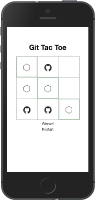

# Git Tac Toe

## The idea

Enjoy the classic game of Tic Tac Toe with a subtle GitHub twist. Bring a friend. It was made for two.

## How to play
Easy. Visit this link now, or bookmark it for later: [https://ns-mlryykpypx.now.sh](https://ns-mlryykpypx.now.sh)

If you're wondering why the link is quite odd… as a simple and free way to deploy the app, I used the [now](https://zeit.co/now/) service.

The app was built using [create-react-app](https://github.com/facebookincubator/create-react-app), along with following [Facebook's own React tutorial](https://facebook.github.io/react/tutorial/tutorial.html). A handful of enhancements were made, including accessibility features and styles.

I work at [Synapse Studios](https://synapsestudios.com).
